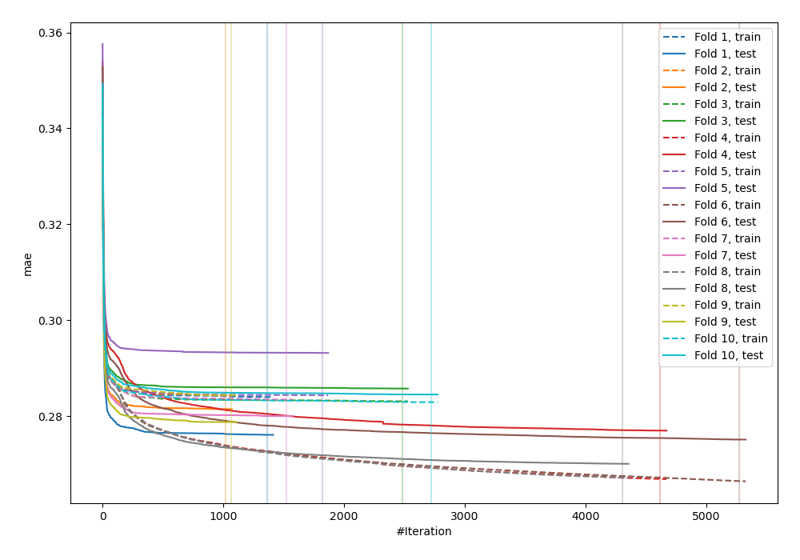
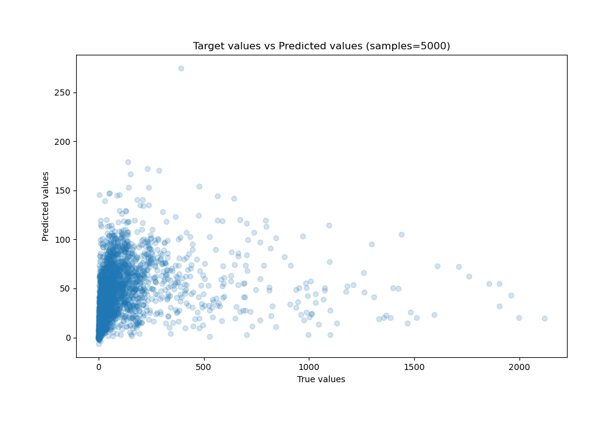
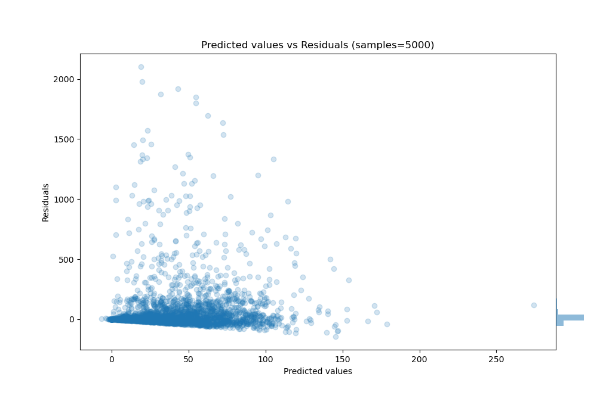

# Summary of 28_CatBoost_GoldenFeatures

[<< Go back](../README.md)

## CatBoost
- **n_jobs**: -1
- **learning_rate**: 0.1
- **depth**: 5
- **rsm**: 0.8
- **loss_function**: MAPE
- **eval_metric**: MAE
- **explain_level**: 0

## Validation
 - **validation_type**: kfold
 - **k_folds**: 10
 - **shuffle**: True

## Optimized metric
mae

## Training time

1114.5 seconds

### Metric details:
| Metric   |           Score |
|:---------|----------------:|
| MAE      |    47.8539      |
| MSE      | 27825.1         |
| RMSE     |   166.809       |
| R2       |     0.0462948   |
| MAPE     |     4.43829e+10 |

## Learning curves

## True vs Predicted

## Predicted vs Residuals

[<< Go back](../README.md)
