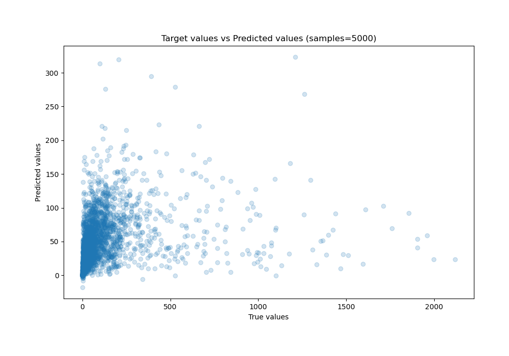

# Summary of 29_CatBoost_GoldenFeatures_RandomFeature

[<< Go back](../README.md)

## CatBoost
- **n_jobs**: -1
- **learning_rate**: 0.2
- **depth**: 7
- **rsm**: 1.0
- **loss_function**: MAPE
- **eval_metric**: MAE
- **explain_level**: 1

## Validation
 - **validation_type**: kfold
 - **k_folds**: 10
 - **shuffle**: True

## Optimized metric
mae

## Training time

540.1 seconds

### Metric details:
| Metric   |           Score |
|:---------|----------------:|
| MAE      |    46.0504      |
| MSE      | 26405.5         |
| RMSE     |   162.498       |
| R2       |     0.0949537   |
| MAPE     |     9.82809e+09 |

## Learning curves

## Permutation-based Importance

## True vs Predicted

## Predicted vs Residuals

[<< Go back](../README.md)
