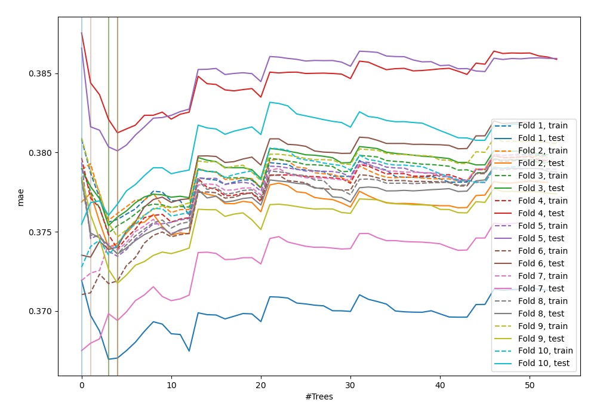
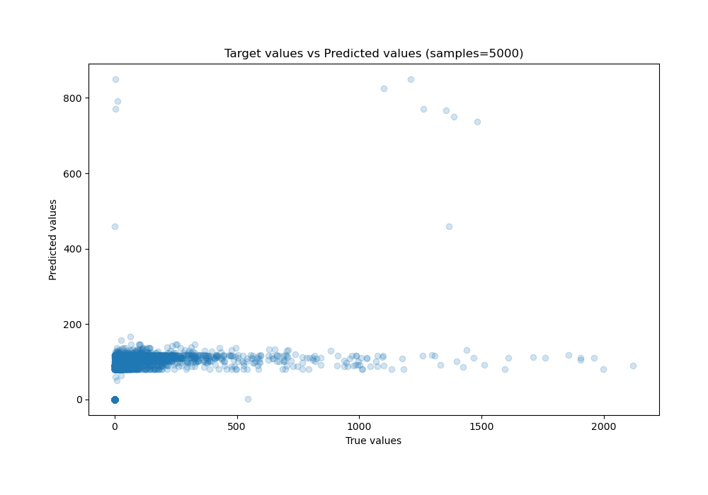
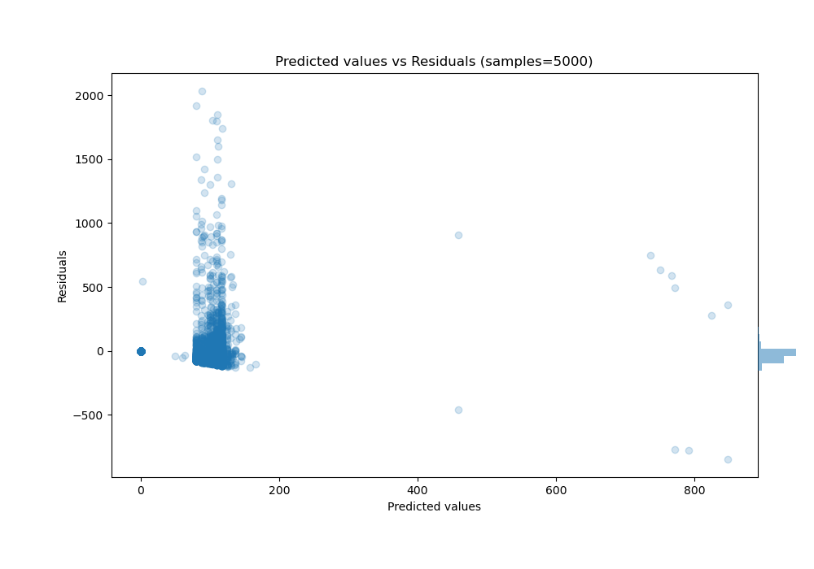

# Summary of 36_RandomForest

[<< Go back](../README.md)

## Random Forest
- **n_jobs**: -1
- **criterion**: squared_error
- **max_features**: 0.7
- **min_samples_split**: 50
- **max_depth**: 3
- **eval_metric_name**: mae
- **explain_level**: 0

## Validation
 - **validation_type**: kfold
 - **k_folds**: 10
 - **shuffle**: True

## Optimized metric
mae

## Training time

174.0 seconds

### Metric details:
| Metric   |           Score |
|:---------|----------------:|
| MAE      |    63.872       |
| MSE      | 25554.7         |
| RMSE     |   159.858       |
| R2       |     0.124114    |
| MAPE     |     2.66329e+13 |

## Learning curves

## True vs Predicted

## Predicted vs Residuals

[<< Go back](../README.md)
