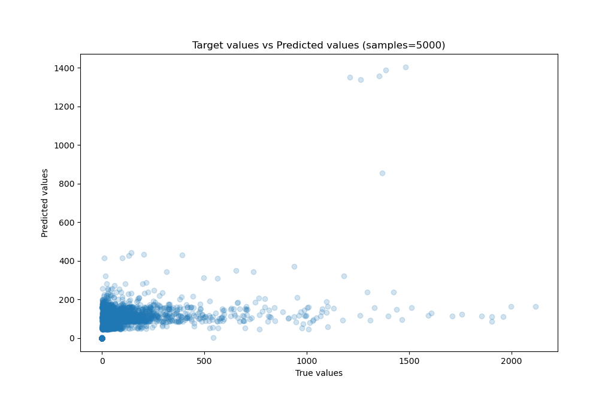
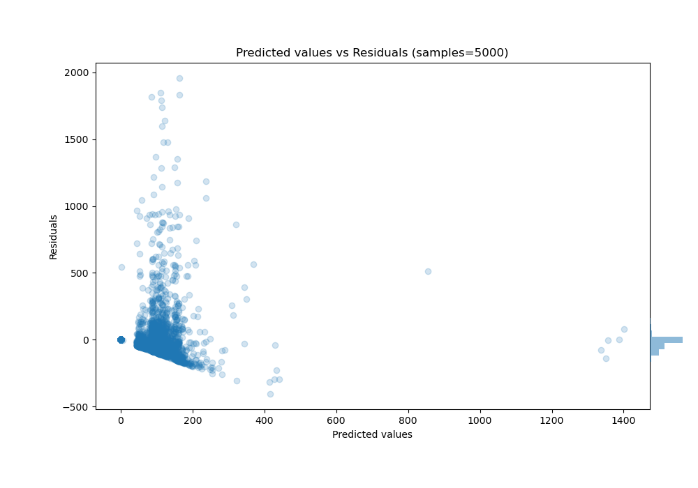

# Summary of 38_RandomForest_SelectedFeatures

[<< Go back](../README.md)

## Random Forest
- **n_jobs**: -1
- **criterion**: squared_error
- **max_features**: 0.8
- **min_samples_split**: 40
- **max_depth**: 6
- **eval_metric_name**: mae
- **explain_level**: 0

## Validation
 - **validation_type**: kfold
 - **k_folds**: 10
 - **shuffle**: True

## Optimized metric
mae

## Training time

161.5 seconds

### Metric details:
| Metric   |           Score |
|:---------|----------------:|
| MAE      |    59.8116      |
| MSE      | 23416.7         |
| RMSE     |   153.025       |
| R2       |     0.197393    |
| MAPE     |     1.49608e+13 |

## Learning curves

## True vs Predicted

## Predicted vs Residuals

[<< Go back](../README.md)
