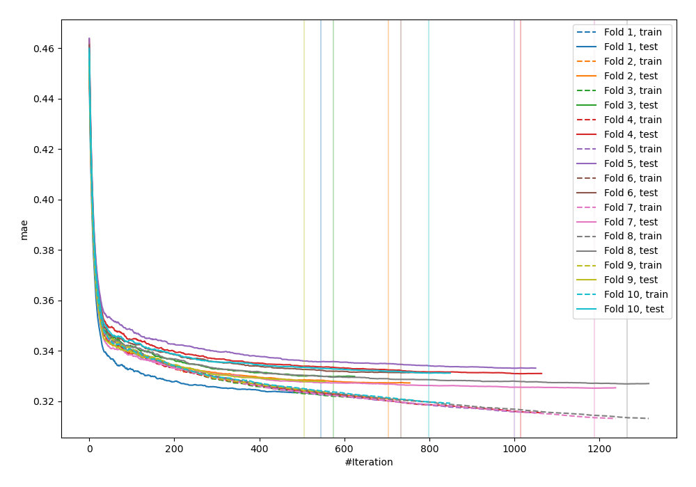
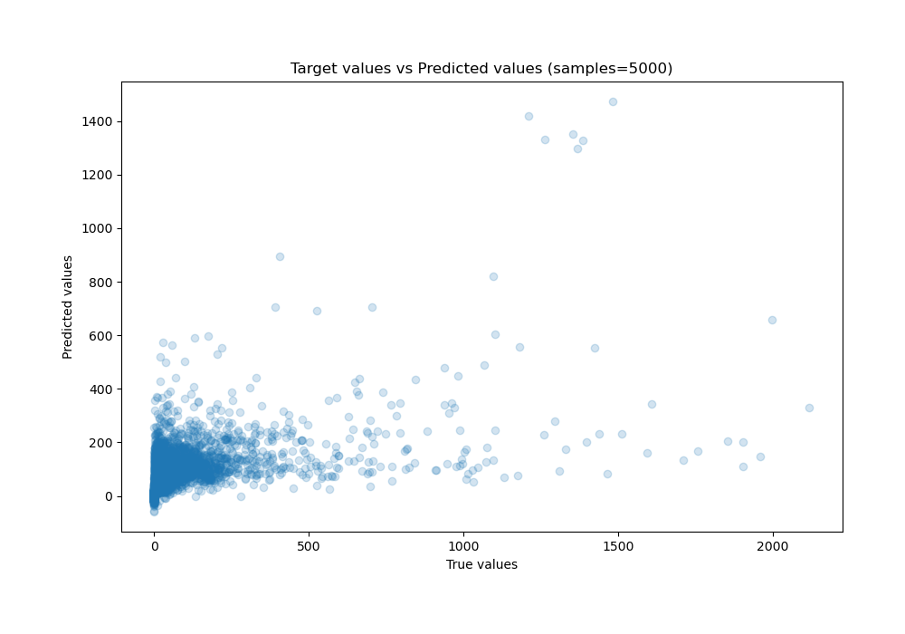
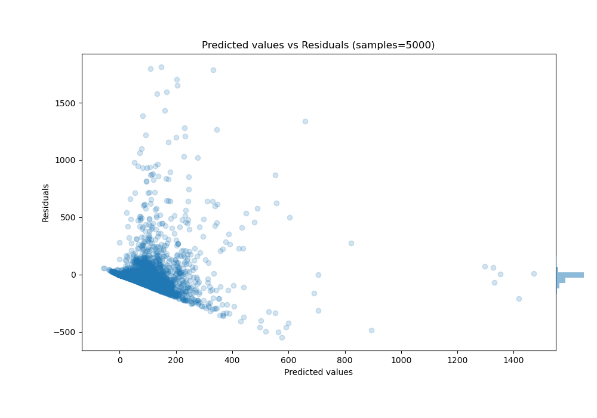

# Summary of 3_Default_CatBoost

[<< Go back](../README.md)

## CatBoost
- **n_jobs**: -1
- **learning_rate**: 0.1
- **depth**: 6
- **rsm**: 1
- **loss_function**: RMSE
- **eval_metric**: MAE
- **explain_level**: 0

## Validation
 - **validation_type**: kfold
 - **k_folds**: 10
 - **shuffle**: True

## Optimized metric
mae

## Training time

296.7 seconds

### Metric details:
| Metric   |           Score |
|:---------|----------------:|
| MAE      |    56.1356      |
| MSE      | 20211.4         |
| RMSE     |   142.167       |
| R2       |     0.307254    |
| MAPE     |     9.51948e+15 |

## Learning curves

## True vs Predicted

## Predicted vs Residuals

[<< Go back](../README.md)
