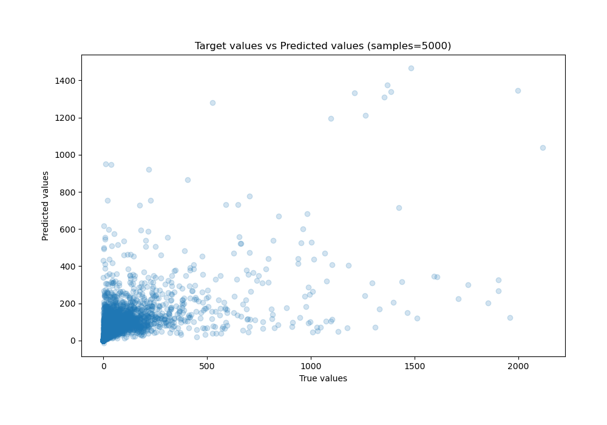
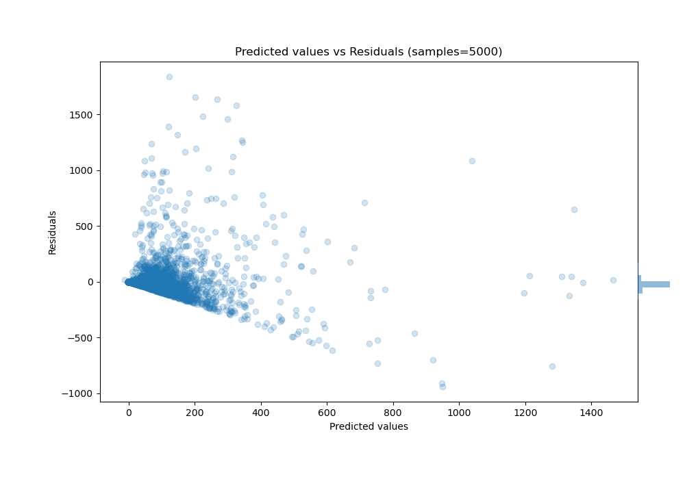

# Summary of 44_LightGBM_SelectedFeatures_Stacked

[<< Go back](../README.md)

## LightGBM
- **n_jobs**: -1
- **objective**: regression
- **num_leaves**: 63
- **learning_rate**: 0.1
- **feature_fraction**: 1.0
- **bagging_fraction**: 0.5
- **min_data_in_leaf**: 10
- **metric**: l1
- **custom_eval_metric_name**: None
- **explain_level**: 0

## Validation
 - **validation_type**: kfold
 - **k_folds**: 10
 - **shuffle**: True

## Optimized metric
mae

## Training time

46.3 seconds

### Metric details:
| Metric   |           Score |
|:---------|----------------:|
| MAE      |    50.7924      |
| MSE      | 19125.7         |
| RMSE     |   138.296       |
| R2       |     0.344467    |
| MAPE     |     1.13196e+15 |

## Learning curves

## True vs Predicted

## Predicted vs Residuals

[<< Go back](../README.md)
