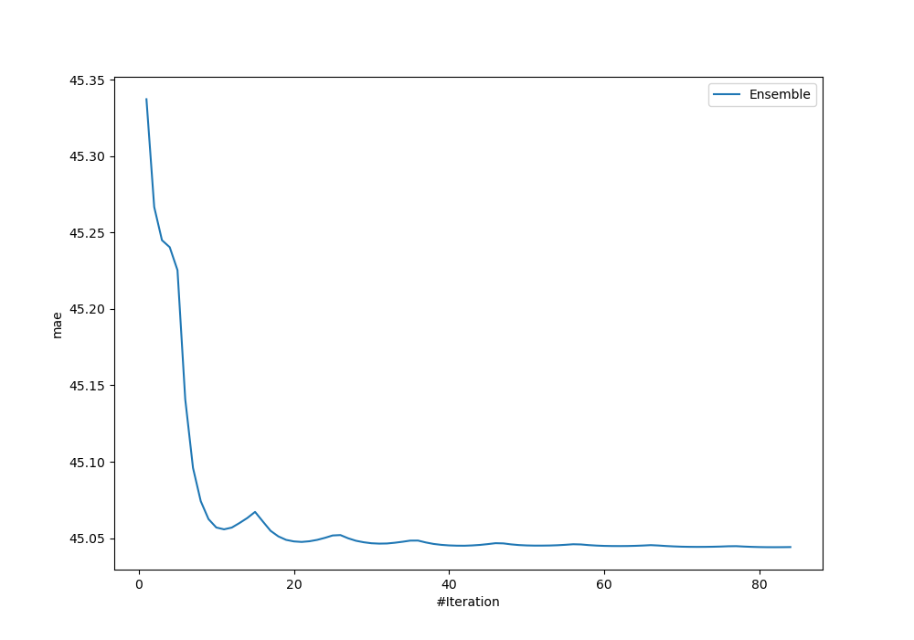
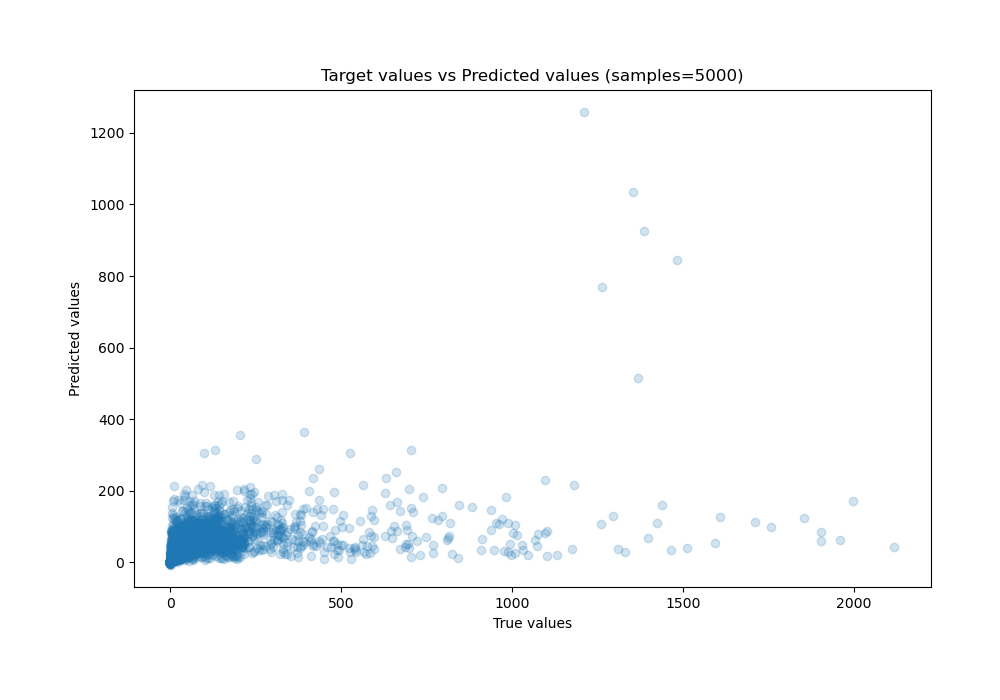
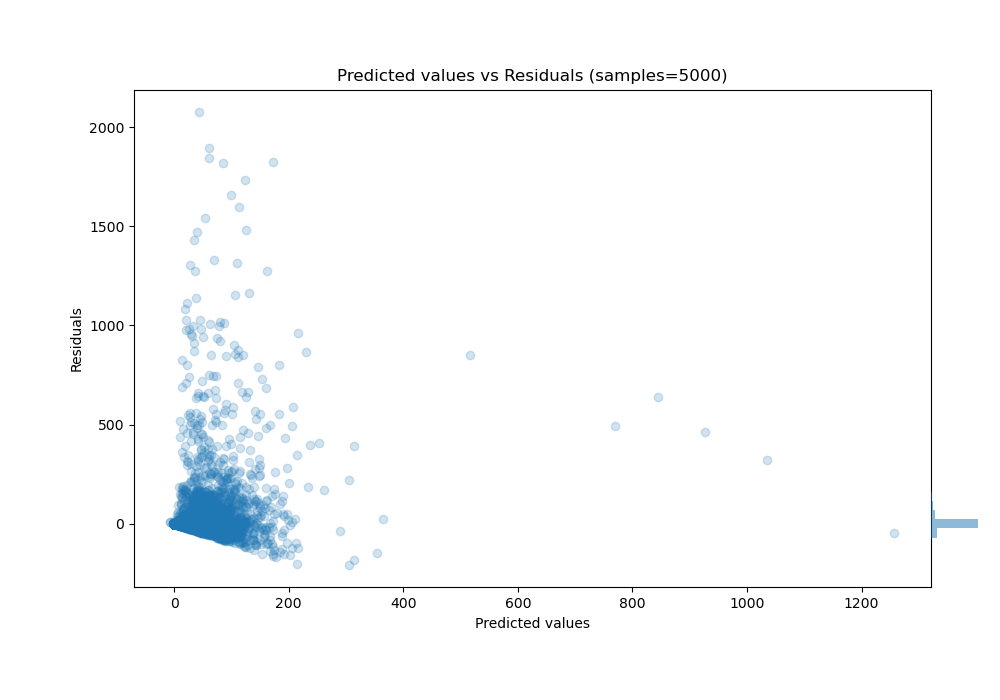

# Summary of Ensemble

[<< Go back](../README.md)

## Ensemble structure
| Model                                                     |   Weight |
|:----------------------------------------------------------|---------:|
| 21_LightGBM_SelectedFeatures                              |        1 |
| 29_CatBoost_GoldenFeatures_SelectedFeatures               |       35 |
| 29_CatBoost_GoldenFeatures_SelectedFeatures_BoostOnErrors |       14 |
| 41_CatBoost_GoldenFeatures_SelectedFeatures               |       10 |
| 45_LightGBM_SelectedFeatures                              |        2 |
| 47_LightGBM                                               |        1 |
| 58_CatBoost_GoldenFeatures_SelectedFeatures               |       15 |
| 59_LightGBM_SelectedFeatures                              |        3 |
| 61_LightGBM_SelectedFeatures                              |        1 |

### Metric details:
| Metric   |           Score |
|:---------|----------------:|
| MAE      |    45.0441      |
| MSE      | 24154.5         |
| RMSE     |   155.417       |
| R2       |     0.172106    |
| MAPE     |     2.59302e+14 |

## Learning curves

## True vs Predicted

## Predicted vs Residuals

[<< Go back](../README.md)
