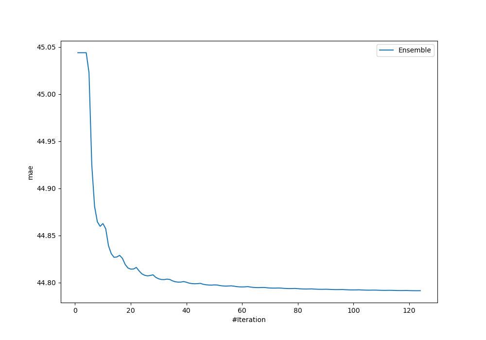
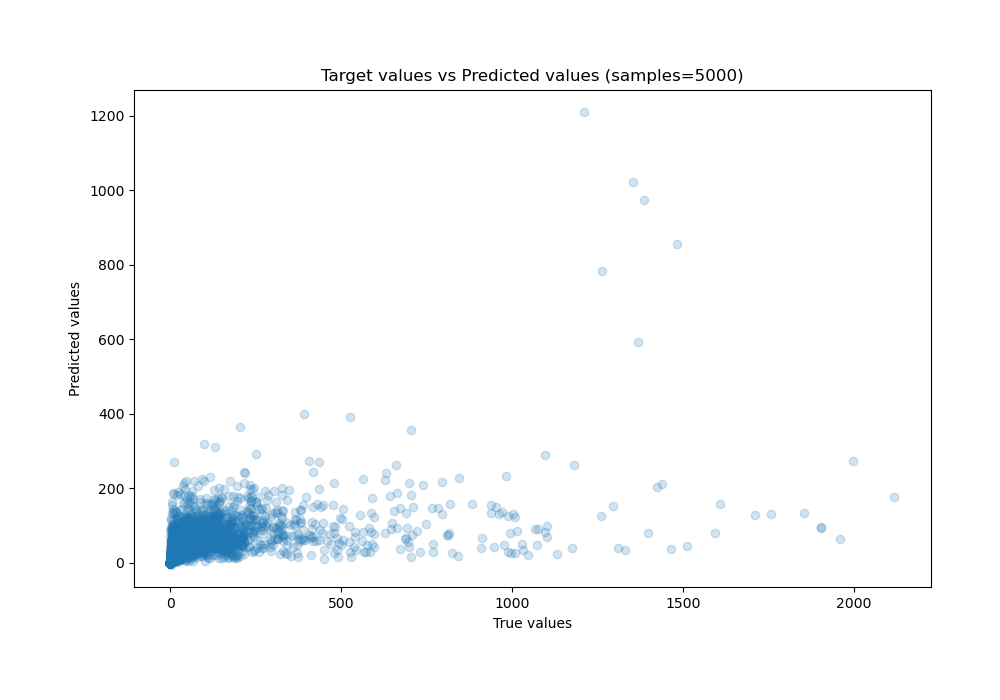
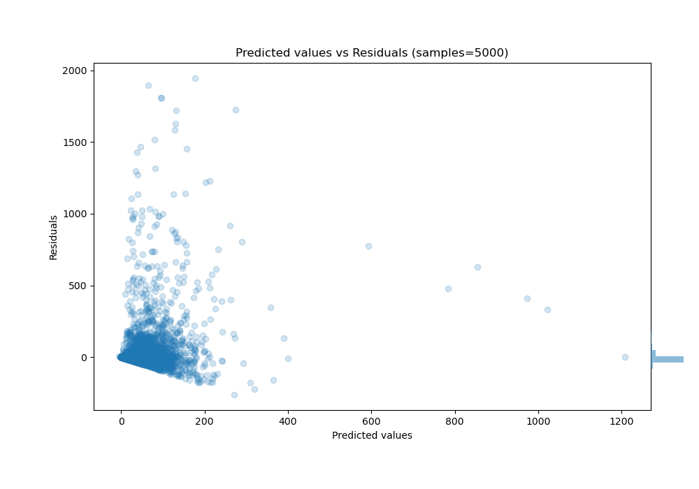

# Summary of Ensemble_Stacked

[<< Go back](../README.md)

## Ensemble structure
| Model                                                     |   Weight |
|:----------------------------------------------------------|---------:|
| 29_CatBoost_GoldenFeatures_SelectedFeatures               |       48 |
| 29_CatBoost_GoldenFeatures_SelectedFeatures_BoostOnErrors |       15 |
| 29_CatBoost_GoldenFeatures_Stacked                        |        3 |
| 41_CatBoost_GoldenFeatures_SelectedFeatures               |       12 |
| 50_Xgboost_Stacked                                        |        3 |
| 58_CatBoost_GoldenFeatures_SelectedFeatures               |       20 |
| 65_Xgboost_SelectedFeatures_Stacked                       |        4 |
| 67_Xgboost_Stacked                                        |        8 |
| 7_Xgboost_Stacked                                         |        6 |
| Ensemble                                                  |        4 |

### Metric details:
| Metric   |           Score |
|:---------|----------------:|
| MAE      |    44.7912      |
| MSE      | 23170.1         |
| RMSE     |   152.217       |
| R2       |     0.205847    |
| MAPE     |     1.33747e+14 |

## Learning curves

## True vs Predicted

## Predicted vs Residuals

[<< Go back](../README.md)
