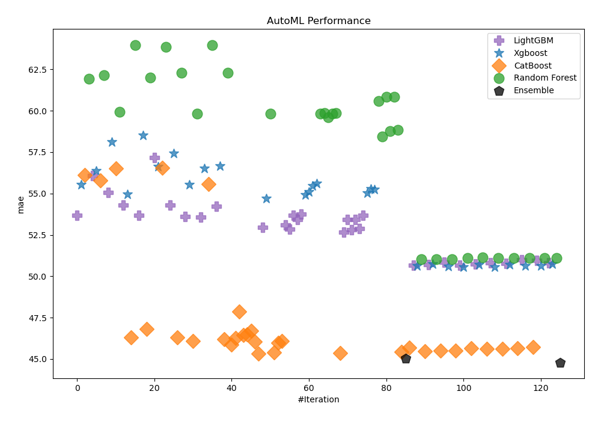

# AutoML Leaderboard

| Best model   | name                                                                                                                             | model_type    | metric_type   |   metric_value |   train_time |
|:-------------|:---------------------------------------------------------------------------------------------------------------------------------|:--------------|:--------------|---------------:|-------------:|
|              | [1_Default_LightGBM](1_Default_LightGBM/README.md)                                                                               | LightGBM      | mae           |        53.6754 |       223.61 |
|              | [2_Default_Xgboost](2_Default_Xgboost/README.md)                                                                                 | Xgboost       | mae           |        55.5398 |       103.24 |
|              | [3_Default_CatBoost](3_Default_CatBoost/README.md)                                                                               | CatBoost      | mae           |        56.1356 |       299.61 |
|              | [4_Default_RandomForest](4_Default_RandomForest/README.md)                                                                       | Random Forest | mae           |        61.9491 |      3099.8  |
|              | [14_LightGBM](14_LightGBM/README.md)                                                                                             | LightGBM      | mae           |        56.0908 |        43.15 |
|              | [5_Xgboost](5_Xgboost/README.md)                                                                                                 | Xgboost       | mae           |        56.375  |        42.96 |
|              | [23_CatBoost](23_CatBoost/README.md)                                                                                             | CatBoost      | mae           |        55.8018 |       173.91 |
|              | [32_RandomForest](32_RandomForest/README.md)                                                                                     | Random Forest | mae           |        62.1553 |       460.51 |
|              | [15_LightGBM](15_LightGBM/README.md)                                                                                             | LightGBM      | mae           |        55.0628 |        98.22 |
|              | [6_Xgboost](6_Xgboost/README.md)                                                                                                 | Xgboost       | mae           |        58.1189 |        39.67 |
|              | [24_CatBoost](24_CatBoost/README.md)                                                                                             | CatBoost      | mae           |        56.5161 |       116.2  |
|              | [33_RandomForest](33_RandomForest/README.md)                                                                                     | Random Forest | mae           |        59.9233 |       177.28 |
|              | [16_LightGBM](16_LightGBM/README.md)                                                                                             | LightGBM      | mae           |        54.3033 |       237.71 |
|              | [7_Xgboost](7_Xgboost/README.md)                                                                                                 | Xgboost       | mae           |        54.9593 |        67.56 |
|              | [25_CatBoost](25_CatBoost/README.md)                                                                                             | CatBoost      | mae           |        46.2976 |      2054.94 |
|              | [34_RandomForest](34_RandomForest/README.md)                                                                                     | Random Forest | mae           |        63.9889 |       102.32 |
|              | [17_LightGBM](17_LightGBM/README.md)                                                                                             | LightGBM      | mae           |        53.6698 |       261.98 |
|              | [8_Xgboost](8_Xgboost/README.md)                                                                                                 | Xgboost       | mae           |        58.5145 |        80.11 |
|              | [26_CatBoost](26_CatBoost/README.md)                                                                                             | CatBoost      | mae           |        46.7968 |      1826.69 |
|              | [35_RandomForest](35_RandomForest/README.md)                                                                                     | Random Forest | mae           |        61.9974 |       192.78 |
|              | [18_LightGBM](18_LightGBM/README.md)                                                                                             | LightGBM      | mae           |        57.175  |        44.7  |
|              | [9_Xgboost](9_Xgboost/README.md)                                                                                                 | Xgboost       | mae           |        56.6347 |       109.69 |
|              | [27_CatBoost](27_CatBoost/README.md)                                                                                             | CatBoost      | mae           |        56.5418 |       624.79 |
|              | [36_RandomForest](36_RandomForest/README.md)                                                                                     | Random Forest | mae           |        63.872  |       178.63 |
|              | [19_LightGBM](19_LightGBM/README.md)                                                                                             | LightGBM      | mae           |        54.313  |       110.62 |
|              | [10_Xgboost](10_Xgboost/README.md)                                                                                               | Xgboost       | mae           |        57.4232 |        93.4  |
|              | [28_CatBoost](28_CatBoost/README.md)                                                                                             | CatBoost      | mae           |        46.2952 |      3128.49 |
|              | [37_RandomForest](37_RandomForest/README.md)                                                                                     | Random Forest | mae           |        62.2825 |       198.54 |
|              | [20_LightGBM](20_LightGBM/README.md)                                                                                             | LightGBM      | mae           |        53.6256 |        63.53 |
|              | [11_Xgboost](11_Xgboost/README.md)                                                                                               | Xgboost       | mae           |        55.5458 |        41.42 |
|              | [29_CatBoost](29_CatBoost/README.md)                                                                                             | CatBoost      | mae           |        46.0672 |       547.39 |
|              | [38_RandomForest](38_RandomForest/README.md)                                                                                     | Random Forest | mae           |        59.8148 |       350.34 |
|              | [21_LightGBM](21_LightGBM/README.md)                                                                                             | LightGBM      | mae           |        53.5658 |        83.11 |
|              | [12_Xgboost](12_Xgboost/README.md)                                                                                               | Xgboost       | mae           |        56.5099 |        57.18 |
|              | [30_CatBoost](30_CatBoost/README.md)                                                                                             | CatBoost      | mae           |        55.5875 |       223.3  |
|              | [39_RandomForest](39_RandomForest/README.md)                                                                                     | Random Forest | mae           |        63.9555 |       154.1  |
|              | [22_LightGBM](22_LightGBM/README.md)                                                                                             | LightGBM      | mae           |        54.2423 |        60.64 |
|              | [13_Xgboost](13_Xgboost/README.md)                                                                                               | Xgboost       | mae           |        56.6636 |       127.26 |
|              | [31_CatBoost](31_CatBoost/README.md)                                                                                             | CatBoost      | mae           |        46.19   |      3854.8  |
|              | [40_RandomForest](40_RandomForest/README.md)                                                                                     | Random Forest | mae           |        62.3145 |       183.16 |
|              | [29_CatBoost_GoldenFeatures](29_CatBoost_GoldenFeatures/README.md)                                                               | CatBoost      | mae           |        45.8536 |       600.69 |
|              | [31_CatBoost_GoldenFeatures](31_CatBoost_GoldenFeatures/README.md)                                                               | CatBoost      | mae           |        46.2654 |      3488.19 |
|              | [28_CatBoost_GoldenFeatures](28_CatBoost_GoldenFeatures/README.md)                                                               | CatBoost      | mae           |        47.8539 |      1115.97 |
|              | [29_CatBoost_KMeansFeatures](29_CatBoost_KMeansFeatures/README.md)                                                               | CatBoost      | mae           |        46.4311 |       583.54 |
|              | [31_CatBoost_KMeansFeatures](31_CatBoost_KMeansFeatures/README.md)                                                               | CatBoost      | mae           |        46.4903 |      4075.26 |
|              | [28_CatBoost_KMeansFeatures](28_CatBoost_KMeansFeatures/README.md)                                                               | CatBoost      | mae           |        46.6985 |      1599.57 |
|              | [29_CatBoost_GoldenFeatures_RandomFeature](29_CatBoost_GoldenFeatures_RandomFeature/README.md)                                   | CatBoost      | mae           |        46.0504 |       541.78 |
|              | [29_CatBoost_GoldenFeatures_SelectedFeatures](29_CatBoost_GoldenFeatures_SelectedFeatures/README.md)                             | CatBoost      | mae           |        45.3373 |       601.64 |
|              | [21_LightGBM_SelectedFeatures](21_LightGBM_SelectedFeatures/README.md)                                                           | LightGBM      | mae           |        52.9554 |       101.28 |
|              | [7_Xgboost_SelectedFeatures](7_Xgboost_SelectedFeatures/README.md)                                                               | Xgboost       | mae           |        54.7111 |       109.2  |
|              | [38_RandomForest_SelectedFeatures](38_RandomForest_SelectedFeatures/README.md)                                                   | Random Forest | mae           |        59.8116 |       162.66 |
|              | [41_CatBoost_GoldenFeatures_SelectedFeatures](41_CatBoost_GoldenFeatures_SelectedFeatures/README.md)                             | CatBoost      | mae           |        45.3985 |      1076.11 |
|              | [42_CatBoost_GoldenFeatures](42_CatBoost_GoldenFeatures/README.md)                                                               | CatBoost      | mae           |        45.9797 |       976.11 |
|              | [43_CatBoost](43_CatBoost/README.md)                                                                                             | CatBoost      | mae           |        46.0882 |       761.73 |
|              | [44_LightGBM_SelectedFeatures](44_LightGBM_SelectedFeatures/README.md)                                                           | LightGBM      | mae           |        53.114  |       111.38 |
|              | [45_LightGBM_SelectedFeatures](45_LightGBM_SelectedFeatures/README.md)                                                           | LightGBM      | mae           |        52.8552 |       106.22 |
|              | [46_LightGBM](46_LightGBM/README.md)                                                                                             | LightGBM      | mae           |        53.6752 |        91.85 |
|              | [47_LightGBM](47_LightGBM/README.md)                                                                                             | LightGBM      | mae           |        53.4198 |        93.13 |
|              | [48_LightGBM](48_LightGBM/README.md)                                                                                             | LightGBM      | mae           |        53.7606 |        67.41 |
|              | [49_Xgboost_SelectedFeatures](49_Xgboost_SelectedFeatures/README.md)                                                             | Xgboost       | mae           |        54.9106 |        75.68 |
|              | [50_Xgboost](50_Xgboost/README.md)                                                                                               | Xgboost       | mae           |        55.1028 |        74.69 |
|              | [51_Xgboost](51_Xgboost/README.md)                                                                                               | Xgboost       | mae           |        55.4652 |       177.27 |
|              | [52_Xgboost](52_Xgboost/README.md)                                                                                               | Xgboost       | mae           |        55.603  |        98.73 |
|              | [53_RandomForest_SelectedFeatures](53_RandomForest_SelectedFeatures/README.md)                                                   | Random Forest | mae           |        59.8177 |       224.11 |
|              | [54_RandomForest_SelectedFeatures](54_RandomForest_SelectedFeatures/README.md)                                                   | Random Forest | mae           |        59.8693 |       237.64 |
|              | [55_RandomForest](55_RandomForest/README.md)                                                                                     | Random Forest | mae           |        59.5941 |       209.8  |
|              | [56_RandomForest](56_RandomForest/README.md)                                                                                     | Random Forest | mae           |        59.822  |       304.96 |
|              | [57_RandomForest](57_RandomForest/README.md)                                                                                     | Random Forest | mae           |        59.8752 |       236.87 |
|              | [58_CatBoost_GoldenFeatures_SelectedFeatures](58_CatBoost_GoldenFeatures_SelectedFeatures/README.md)                             | CatBoost      | mae           |        45.3733 |      2129.88 |
|              | [59_LightGBM_SelectedFeatures](59_LightGBM_SelectedFeatures/README.md)                                                           | LightGBM      | mae           |        52.6596 |       217.65 |
|              | [60_LightGBM_SelectedFeatures](60_LightGBM_SelectedFeatures/README.md)                                                           | LightGBM      | mae           |        53.4324 |        55.5  |
|              | [61_LightGBM_SelectedFeatures](61_LightGBM_SelectedFeatures/README.md)                                                           | LightGBM      | mae           |        52.7945 |       176.12 |
|              | [62_LightGBM_SelectedFeatures](62_LightGBM_SelectedFeatures/README.md)                                                           | LightGBM      | mae           |        53.437  |        56.69 |
|              | [63_LightGBM_SelectedFeatures](63_LightGBM_SelectedFeatures/README.md)                                                           | LightGBM      | mae           |        52.8871 |       231.96 |
|              | [64_LightGBM_SelectedFeatures](64_LightGBM_SelectedFeatures/README.md)                                                           | LightGBM      | mae           |        53.6741 |        55.52 |
|              | [65_Xgboost_SelectedFeatures](65_Xgboost_SelectedFeatures/README.md)                                                             | Xgboost       | mae           |        55.0349 |       129.73 |
|              | [66_Xgboost_SelectedFeatures](66_Xgboost_SelectedFeatures/README.md)                                                             | Xgboost       | mae           |        55.2798 |        84.55 |
|              | [67_Xgboost](67_Xgboost/README.md)                                                                                               | Xgboost       | mae           |        55.2515 |       115.76 |
|              | [68_RandomForest](68_RandomForest/README.md)                                                                                     | Random Forest | mae           |        60.5824 |       166.23 |
|              | [69_RandomForest](69_RandomForest/README.md)                                                                                     | Random Forest | mae           |        58.4274 |       235.51 |
|              | [70_RandomForest_SelectedFeatures](70_RandomForest_SelectedFeatures/README.md)                                                   | Random Forest | mae           |        60.8582 |       206.3  |
|              | [71_RandomForest_SelectedFeatures](71_RandomForest_SelectedFeatures/README.md)                                                   | Random Forest | mae           |        58.7739 |       216.73 |
|              | [72_RandomForest](72_RandomForest/README.md)                                                                                     | Random Forest | mae           |        60.8478 |       208.16 |
|              | [73_RandomForest](73_RandomForest/README.md)                                                                                     | Random Forest | mae           |        58.8292 |       383.23 |
|              | [29_CatBoost_GoldenFeatures_SelectedFeatures_BoostOnErrors](29_CatBoost_GoldenFeatures_SelectedFeatures_BoostOnErrors/README.md) | CatBoost      | mae           |        45.4274 |       675.85 |
|              | [Ensemble](Ensemble/README.md)                                                                                                   | Ensemble      | mae           |        45.0441 |        49.04 |
|              | [29_CatBoost_GoldenFeatures_SelectedFeatures_Stacked](29_CatBoost_GoldenFeatures_SelectedFeatures_Stacked/README.md)             | CatBoost      | mae           |        45.6725 |       122.67 |
|              | [59_LightGBM_SelectedFeatures_Stacked](59_LightGBM_SelectedFeatures_Stacked/README.md)                                           | LightGBM      | mae           |        50.6812 |        97.37 |
|              | [7_Xgboost_SelectedFeatures_Stacked](7_Xgboost_SelectedFeatures_Stacked/README.md)                                               | Xgboost       | mae           |        50.6265 |       134.3  |
|              | [69_RandomForest_Stacked](69_RandomForest_Stacked/README.md)                                                                     | Random Forest | mae           |        51.0102 |      1670.8  |
|              | [58_CatBoost_GoldenFeatures_SelectedFeatures_Stacked](58_CatBoost_GoldenFeatures_SelectedFeatures_Stacked/README.md)             | CatBoost      | mae           |        45.4719 |       212.17 |
|              | [61_LightGBM_SelectedFeatures_Stacked](61_LightGBM_SelectedFeatures_Stacked/README.md)                                           | LightGBM      | mae           |        50.7024 |        83.59 |
|              | [49_Xgboost_SelectedFeatures_Stacked](49_Xgboost_SelectedFeatures_Stacked/README.md)                                             | Xgboost       | mae           |        50.7457 |       101.57 |
|              | [71_RandomForest_SelectedFeatures_Stacked](71_RandomForest_SelectedFeatures_Stacked/README.md)                                   | Random Forest | mae           |        51.019  |      1894.38 |
|              | [41_CatBoost_GoldenFeatures_SelectedFeatures_Stacked](41_CatBoost_GoldenFeatures_SelectedFeatures_Stacked/README.md)             | CatBoost      | mae           |        45.4999 |       143.47 |
|              | [45_LightGBM_SelectedFeatures_Stacked](45_LightGBM_SelectedFeatures_Stacked/README.md)                                           | LightGBM      | mae           |        50.8426 |        64.02 |
|              | [7_Xgboost_Stacked](7_Xgboost_Stacked/README.md)                                                                                 | Xgboost       | mae           |        50.6036 |       140.21 |
|              | [73_RandomForest_Stacked](73_RandomForest_Stacked/README.md)                                                                     | Random Forest | mae           |        51.0283 |      1997.41 |
|              | [29_CatBoost_GoldenFeatures_Stacked](29_CatBoost_GoldenFeatures_Stacked/README.md)                                               | CatBoost      | mae           |        45.4939 |       182.18 |
|              | [63_LightGBM_SelectedFeatures_Stacked](63_LightGBM_SelectedFeatures_Stacked/README.md)                                           | LightGBM      | mae           |        50.665  |        79.48 |
|              | [65_Xgboost_SelectedFeatures_Stacked](65_Xgboost_SelectedFeatures_Stacked/README.md)                                             | Xgboost       | mae           |        50.5545 |       131.44 |
|              | [55_RandomForest_Stacked](55_RandomForest_Stacked/README.md)                                                                     | Random Forest | mae           |        51.0983 |      1470.5  |
|              | [42_CatBoost_GoldenFeatures_Stacked](42_CatBoost_GoldenFeatures_Stacked/README.md)                                               | CatBoost      | mae           |        45.6415 |       143.5  |
|              | [21_LightGBM_SelectedFeatures_Stacked](21_LightGBM_SelectedFeatures_Stacked/README.md)                                           | LightGBM      | mae           |        50.7543 |        54.42 |
|              | [50_Xgboost_Stacked](50_Xgboost_Stacked/README.md)                                                                               | Xgboost       | mae           |        50.6927 |        98.68 |
|              | [38_RandomForest_SelectedFeatures_Stacked](38_RandomForest_SelectedFeatures_Stacked/README.md)                                   | Random Forest | mae           |        51.1242 |      1608.25 |
|              | [29_CatBoost_Stacked](29_CatBoost_Stacked/README.md)                                                                             | CatBoost      | mae           |        45.5932 |        99.56 |
|              | [44_LightGBM_SelectedFeatures_Stacked](44_LightGBM_SelectedFeatures_Stacked/README.md)                                           | LightGBM      | mae           |        50.7924 |        47.8  |
|              | [67_Xgboost_Stacked](67_Xgboost_Stacked/README.md)                                                                               | Xgboost       | mae           |        50.5603 |       128.07 |
|              | [38_RandomForest_Stacked](38_RandomForest_Stacked/README.md)                                                                     | Random Forest | mae           |        51.1149 |      1347.44 |
|              | [43_CatBoost_Stacked](43_CatBoost_Stacked/README.md)                                                                             | CatBoost      | mae           |        45.6188 |       117.72 |
|              | [47_LightGBM_Stacked](47_LightGBM_Stacked/README.md)                                                                             | LightGBM      | mae           |        50.7859 |        61.08 |
|              | [66_Xgboost_SelectedFeatures_Stacked](66_Xgboost_SelectedFeatures_Stacked/README.md)                                             | Xgboost       | mae           |        50.7145 |        81.84 |
|              | [53_RandomForest_SelectedFeatures_Stacked](53_RandomForest_SelectedFeatures_Stacked/README.md)                                   | Random Forest | mae           |        51.116  |      1069.08 |
|              | [31_CatBoost_Stacked](31_CatBoost_Stacked/README.md)                                                                             | CatBoost      | mae           |        45.6487 |       277.27 |
|              | [60_LightGBM_SelectedFeatures_Stacked](60_LightGBM_SelectedFeatures_Stacked/README.md)                                           | LightGBM      | mae           |        50.9747 |        44.65 |
|              | [51_Xgboost_Stacked](51_Xgboost_Stacked/README.md)                                                                               | Xgboost       | mae           |        50.612  |       106.55 |
|              | [56_RandomForest_Stacked](56_RandomForest_Stacked/README.md)                                                                     | Random Forest | mae           |        51.1154 |      1320.5  |
|              | [31_CatBoost_GoldenFeatures_Stacked](31_CatBoost_GoldenFeatures_Stacked/README.md)                                               | CatBoost      | mae           |        45.713  |       285.28 |
|              | [62_LightGBM_SelectedFeatures_Stacked](62_LightGBM_SelectedFeatures_Stacked/README.md)                                           | LightGBM      | mae           |        50.9533 |        42.25 |
|              | [2_Default_Xgboost_Stacked](2_Default_Xgboost_Stacked/README.md)                                                                 | Xgboost       | mae           |        50.6201 |        83.1  |
|              | [54_RandomForest_SelectedFeatures_Stacked](54_RandomForest_SelectedFeatures_Stacked/README.md)                                   | Random Forest | mae           |        51.1189 |      1461.03 |
|              | [21_LightGBM_Stacked](21_LightGBM_Stacked/README.md)                                                                             | LightGBM      | mae           |        50.8109 |        56.35 |
|              | [11_Xgboost_Stacked](11_Xgboost_Stacked/README.md)                                                                               | Xgboost       | mae           |        50.7491 |        65.66 |
|              | [57_RandomForest_Stacked](57_RandomForest_Stacked/README.md)                                                                     | Random Forest | mae           |        51.0949 |      1060.5  |
| **the best** | [Ensemble_Stacked](Ensemble_Stacked/README.md)                                                                                   | Ensemble      | mae           |        44.7912 |       118.46 |

### AutoML Performance

### AutoML Performance Boxplot

### Spearman Correlation of Models

