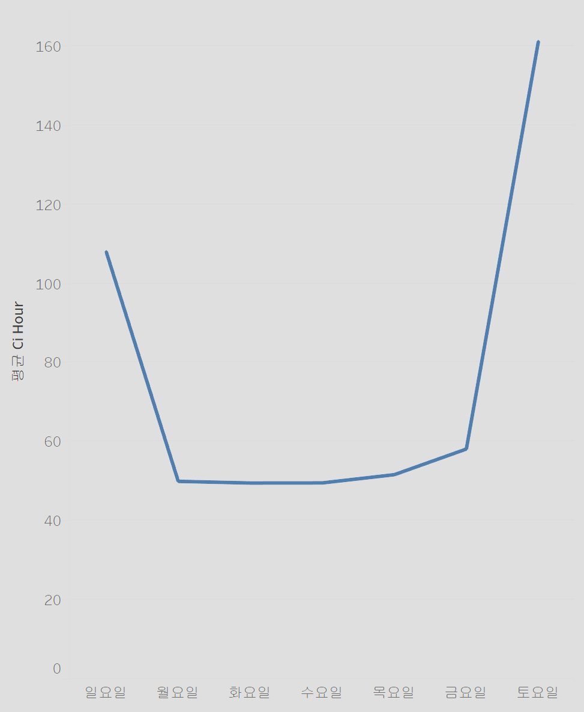
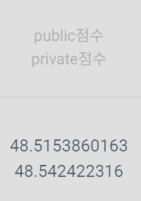

# HD현대-AI Challenge
본 페이지는 HD한국조선해양 AI Center에서 주관하는 DACON에서 열린 HD현대 AI Challenge의 수행 과정을 다뤘습니다.
***
**[배경]**    
>조선해양 분야 데이터를 기반으로 한 'HD현대 AI Challenge'를 개최됩니다.
코로나19 이후 물류 정체로 인해 다수의 항만에서 선박 대기 시간이 길어지고, 이로 인한 물류 지연이 화두가 되고 있습니다. 
특히 전 세계 물동량의 85%를 차지하는 해운 물류 분야에서 항만 정체는 큰 문제로 인식되고 있는 상황입니다. 
본 대회에서는 접안(배를 육지에 대는 것;Berthing) 전에 선박이 해상에 정박(해상에 닻을 바다 밑바닥에 내려놓고 운항을 멈추는 것;Anchorage)하는 시간을 대기시간으로 정의하고, 선박의 제원 및 운항 정보를 활용하여 산출된 항차(voyage; 선박의 여정) 데이터를 활용하여 항만 內 선박의 대기 시간을 예측하는 AI 알고리즘을 개발을 제안합니다.
이를 통해 선박의 접안 시간 예측이 가능해지고, 선박의 대기시간을 줄임으로써 연료 절감 및 온실가스 감축효과를 기대할 수 있습니다.

**[주제]**

항만 內 선박 대기 시간 예측을 위한 선박 항차 데이터 분석 AI 알고리즘 개발

**[평가 방식]**    
*MAE*(Mean Absoulte Error,평균 절대 오차)

**[활용 데이터]**    
약 40만개의 선박의 제원 및 운항정보

데이터 열 정보

| 열 | 의미 | 단위 |
|---|:---:|---:|
| `ARI_CO` | 도착항의 소속국가(도착항 앞 2글자) |  |
| `ARI_PO` | 도착항의 항구명(도착항 뒤 글자) |  |
| `SHIP_TYPE_CATEGORY` | 선종 5대 선종으로 분류 |  |
| `DIST` | 정박지(ber_port)와 접안지 사이의 거리 | `km` |
| `ATA` | anc_port에 도착한 시점의 utc. 실제 정박 시각(Actual Time of Arrival)	 |  |
| `ID` |    선박식별 일련번호 |  |
| `BREADTH`  | 선박의 폭   | `m` |
| `BUILT`|	선박의 연령	year | |
|`DEADWEIGHT` |	선박의 재화중량톤수 |	`ton`|
|`DEPTH`|선박의 깊이|`m`|
|`DRAUGHT`|	흘수 높이|	`m`|
|`GT`|	용적톤수(Gross Tonnage)값|	`GT(m^3)`|
|`LENGTH`|	선박의 길이|	`m`|
|`SHIPMANAGER`|	선박 소유주|	|
|`FLAG`|	선박의 국적	|
|`U_WIND`|	풍향 u벡터	|`m/s`|
|`V_WIND`|	풍향 v벡터	|`m/s`|
|`AIR_TEMPERATURE`|	기온	|`ºC`|
|`BN`|	보퍼트 풍력 계급|	
|`ATA_LT`|	anc_port에 도착한 시점의 현지 정박 시각(Local Time of Arrival)| `H`|
|`PORT_SIZE`|	접안지 폴리곤 영역의 크기|	`km^2`|
|`CI_HOUR`|	대기시간	|`hour`|

 

* * * 

*[EDA]*

ATA feature 데이터를 datetime으로 변환한 뒤 아래 feature들을 추가       
- year
- month
- day
- hour
- minute
- weekday

ATA, ID, SHIPMANAGER, FLAG 열은 선박 대기시간 과의 연관성이 부족하다 판단하여 제거하였습니다.

weekday열과 선박 대기시간과의 상관관계 그래프입니다

그래프를 보시면 주말과 평일의 평균대기시간의 차이가 확연히 드러나는것을 알 수 있습니다.
그래서 weekday열을 이용해 평일은 0 주말은 1로 구분한 WEEKEND열을 만들어주었습니다.

ARI_CO, ARI_PO, SHIP_TYPE_CATEGORY 세 열은 문자형 데이터이기에
Label encoding을 사용하여 수치형 데이터로 바꾸어주었습니다.

Train 데이터에 존재하지 않는 값이 Test 데이터에 존재할 시에는 그 값을 -1값을 할당해 주었습니다.

LENGTH, DEPTH, BREADTH열을 이용하여 VOLUME이라는 새로운 열을 만들어 주었습니다.       
V = L * B * D

** ** 
**결측치 처리**     

U_WIND, V_WIND, BN과 AIR_TEMPERATURE열은 전체데이터의 40%가 결측치였습니다.     
결측치를 아래와 같은 방법으로 채웠습니다.
- ARI_CO
- ARI_PO
- ATA_LT
- year
- month
- day       

위치, 시간 데이터를 활용해 당시의 기상상태를 추측하고자 **KNN regressor**를 이용하여 결측치를 추측하였습니다.
차원의 저주를 피하기 위하여 위 열들을 **MinMaxScaler**를 사용해 scaling 해준뒤 KNN regressor를 수행해 결측치를 채웠습니다.        
*Why MinMax?*     
위 데이터들은 이상치가 없기에 **MinMaxScaler**를 사용하였습니다.

이후 이상치가 있는 열들은 **RobusterScaler**를 아닌 열은 **MinMaxScaler**를 적용하였습니다.     
이상치가 있는 열은 아래와 같습니다.  
*[Dist, built, DeadWeight, GT, U_wind, v_wind, air_temperature, BN]*      

** **
## 모델 학습 ##
AutoML의 도구 중 하나인 mljar-supervised를 사용하였습니다.
Compete 모드에 mae를 성능평가 기준으로 진행하였고 사용한 알고리즘들은 아래와 같습니다.
- CatBoost
- XgBoost
- LightGBM
- Random Forest     

학습에 소요된 시간은 1038분이고 학습 결과       
**Ensembled Stacked** 모델이 mae가 44.8로 제일 좋게 나왔습니다.

## 예측 결과 ##
앞에서 구한 최적의 모델로 예측을 수행한뒤 예측 결과가 0보다 적게 나온 값을 0으로 수정해 주었습니다.     
예측을 수행한 결과      
       
public 점수 : 48.515        
private 점수 : 48.542       
리더보드 기준 161등을 하였습니다.

## 피드백 및 소감 ##

## 선박 대기 시간 예측을 위한 데이터 논문 발췌 내용 정리 ##

**컨테이너선**

- 선석의 총길이 100m 증가 -> 평균 대기시간 약 10% 감소
- 선석의 평균 길이 100m 증가 -> 평균 대기시간 약 70% 감소

출처 - 선박대기시간 예측모형 개발을 위한 방법론 연구 (A Study on the Methodology for Estimating Vessel Waiting Time)

- 선박의 총톤수 1000톤 증가 -> 선박 재항 시간 약 2.4% 증가

- 동일 톤급 선박 동일 처리능력 부두 접안 시 일반화물선, 산물선 등의 화물운송선박의 재항시간이 풀컨테이너선의 재항시간보다 최대 75% 큰 값을 보임.

출처 - 생존분석모형을 이용한 선박의 재항시간 및 온실가스 배출량 분석 (Analyzing Time in Port and Greenhouse Gas Emissions of Vessels using Duration Model)

- 날씨가 좋을 경우 선적 속도가 빨라지고 일조량이 늘어나기 때문에 선박 대기 시간 감소.

- 날씨가 좋지 않은 경우 화물의 선적 및 하역이 중지되어 선박의 대기 시간 증가.

- 선박의 도착시간이 대기시간에 영향을 미칠 수 있음.

- 오전에 접안하는 선박의 경우 야간에 하역활동 빠르게 진행 가능, 야간에 접안하는 경우 노동자들의 피로와 어두운 상황으로 인해 업무수행이 느려져 대기시간 증가.

출처 - ANALYSIS OF THE INFLUENCE OF SHIP SCHEDULING, GUIDELINE SERVICES, WEATHER, AND LOADING EQUIPMENT READINESS ON SHIP WAITING TIME IN PORT

